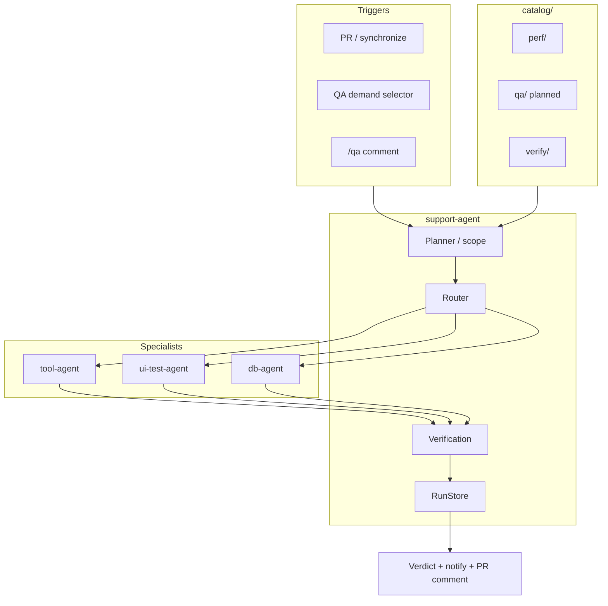

# QA Agent — Keep Plan

> **Status:** Draft — for review  
> **Owner:** AM-Portfolio Infrastructure Team  
> **Implementation repo:** `AM-Portfolio/am-agents`  
> **Last updated:** 2026-07-20

---

## 1. Purpose

Define how AM-Portfolio runs **all major testing** — backend, frontend, system, network, performance, and regression — using the existing agent platform:

| Agent | Role in QA |
|-------|------------|
| **support-agent** | Orchestrator — scope, route, verify, final verdict |
| **tool-agent** | Execute backend, network, load/perf, infra probes |
| **ui-test-agent** | Execute frontend / UI E2E (Playwright) |
| **db-agent** | Optional data-layer checks during incidents |

This plan **extends** what already exists in `am-agents`. It does **not** introduce a parallel orchestrator or duplicate specialist agents.

> **Naming:** `fin-agent` (`am-fin-agent`) is the end-user **finance** agent. It is out of scope for QA unless a finance UI regression is explicitly in the test catalog.

---

## 2. Problem

| Gap today | Impact |
|-----------|--------|
| PR Agent reviews code but does not run tests | Runtime bugs slip through |
| Load/perf catalog exists but is separate from functional QA | Full QA matrix not unified |
| ui-test-agent, tool-agent, support-agent are separate | No single PR-triggered QA verdict |
| Tests scattered across repos and CI jobs | Hard to know what ran and what blocked merge |

---

## 3. Goals

| Goal | Success criteria |
|------|------------------|
| Unified QA orchestration | One demand → one verdict via support-agent |
| Reuse existing specialists | No new tool-agent or ui-test-agent forks |
| Full-stack coverage | Backend, frontend, system, network, performance |
| Catalog-driven | Targets in `catalog/` — code never hardcodes service names (ADR-004) |
| Safe by default | Sandbox, selectors, max fan-out, no prod writes |
| Observable | RunStore steps, traces, evidence artifacts |
| PR-friendly | Optional trigger from `am-pipelines`; labels `qa:pass` / `qa:fail` |

### Non-goals (phase 1)

- Replacing human release sign-off
- Load test every PR
- Auto-merge on QA pass
- Building a new agent monorepo

---

## 4. Architecture



### Request flow

1. **Trigger** — PR event, `QaDemandRequest`, or `/qa` command.
2. **Scope** — support-agent planner reads diff + `catalog/qa/` + `catalog/verify/` (+ perf targets where applicable).
3. **Resolve** — selector expands to target set (ADR-004: empty selector = fatal).
4. **Route** — map each target to specialist via `registry/agents.yaml`.
5. **Execute** — specialists run plan/execute; bounded parallelism (`max_fanout: 8`).
6. **Verify** — support-agent intelligence merges results; applies `failure_mode` (`continue` / `fail_fast`).
7. **Report** — RunStore summary, PR comment, optional Cliq/Grafana notify.

---

## 5. Agent responsibilities

Detailed specs:

- [agents/support-agent.md](./agents/support-agent.md) — orchestrator
- [agents/tool-agent.md](./agents/tool-agent.md) — backend, network, SPT
- [agents/ui-test-agent.md](./agents/ui-test-agent.md) — frontend E2E

### 5.1 support-agent (orchestrator)

- Owns `QaRunWorkflow` (extend existing orchestrator workflows in support-agent)
- Reads catalogs; never embeds service names in workflow code
- Calls specialists over HTTP (A2A / capability contract)
- Writes RunStore (`kind=qa`)
- Produces final `overall_status`: `succeeded` | `partial` | `failed` | `gated`

### 5.2 tool-agent (executor)

- Backend: API smoke, contract checks, repo test commands via sandbox
- Network: DNS, TLS, latency probes (declared hosts only)
- Performance: k6 / load scenarios via existing `tools/spt` capability plugin
- Observe: metrics/logs checks via `tools/observe` + `catalog/verify/`

### 5.3 ui-test-agent (frontend executor)

- Playwright E2E against preview / preprod URL
- Baseline compare, design review, auth flows
- Returns screenshots, traces, report JSON

### 5.4 db-agent (optional)

- Read-only queries during QA incidents or data validation steps
- Not on every PR by default

---

## 6. Catalog plan

| Path | Purpose | Status in am-agents |
|------|---------|---------------------|
| `catalog/verify/` | Health / metrics / log check templates | **Exists** |
| `catalog/qa/` | QA test matrix by domain (incl. perf refs) | **Planned** |
| `catalog/prompts/` | Prompt bodies (not in Python) | **Exists** |

### Planned `catalog/qa/` shape

```text
catalog/qa/
├── backend/          # API smoke refs, pytest entrypoints
├── frontend/         # ui-test-agent scenario refs
├── system/           # multi-step journey refs
├── network/          # probe refs (host allowlist keys)
└── selectors.schema.json
```

Selectors follow ADR-004: `{ "ids": [...], "tags": [...] }` only — no implicit run-all.

See [catalog/README.md](./catalog/README.md).

---

## 7. Testing domains

| Domain | Specialist | Catalog | Examples |
|--------|------------|---------|----------|
| Backend | tool-agent | `catalog/qa/backend/` | pytest, API contract, auth |
| Frontend | ui-test-agent | `catalog/qa/frontend/` | Playwright E2E, a11y smoke |
| System | support-agent fan-out | `catalog/qa/system/` | checkout → webhook journey |
| Network | tool-agent | `catalog/qa/network/` | DNS, TLS, latency |
| Performance | tool-agent | `catalog/qa/perf/` | k6, load policy |
| Verify | tool-agent + observe | `catalog/verify/` | health, metrics, logs |

Full matrix: [testing-domains/overview.md](./testing-domains/overview.md).

---

## 8. Data contracts

See [contracts/README.md](./contracts/README.md).

| Artifact | Producer | Consumer |
|----------|----------|----------|
| `QaDemandRequest` | Gateway / PR trigger | support-agent workflow |
| `TargetSet` | TargetResolver | Router |
| `ChildRunResult` | Specialists | support-agent verify |
| `QaRunSummary` | support-agent | RunStore, notify, PR comment |

Reuse `am_platform_ports` schemas where possible — do not fork DTOs.

---

## 9. Triggers

| Trigger | Entry point | Phase |
|---------|-------------|-------|
| PR opened / sync | `am-pipelines` reusable workflow → support-agent | Phase 2 |
| `/qa`, `/qa backend`, `/qa full` | PR comment handler | Phase 2 |
| Release gate | Manual workflow dispatch | Phase 3 |
| Scheduled regression | Cron → support-agent | Phase 4 |

PR integration stays in `am-pipelines` (same pattern as Gemini PR Agent in `.github`).

---

## 10. Phased rollout

See [phases/PHASES.md](./phases/PHASES.md).

| Phase | Deliverable |
|-------|-------------|
| **0** | This keep plan + review sign-off |
| **1** | `catalog/qa/` schema + sample entries; document registry routing |
| **2** | Extend support-agent workflow for QA demand; PR trigger via am-pipelines |
| **3** | System + network catalog entries; verify loop with `catalog/verify/` |
| **4** | Flaky detection, risk-based selection, dashboard from RunStore |

---

## 11. Safety and governance

| Rule | Source |
|------|--------|
| Empty selector = fatal | ADR-004 |
| `QA_MAX_TARGETS_PER_RUN` default 20 (prod 5) | ADR-004 pattern |
| Secrets via SecretBroker only — never in RunStore / LLM | ADR-002 |
| Sandbox for tool-agent writes | Existing tool-agent safety |
| `failure_mode: continue` default — partial-safe | ADR-004 |
| Human waiver label `qa:waived` for override | New policy (TBD) |

---

## 12. Observability

Reuse support-agent observability (already implemented):

- Prometheus: `support_agent_*` metrics
- OTLP traces → Tempo
- RunStore: `agent_runs` + `agent_run_steps` (Postgres)
- Evidence: MinIO / artifact refs on failure

Business labels: `business_domain`, `outcome`, `automation_mode` — no free-text in metric labels.

---

## 13. Open decisions (for review)

| # | Question | Options |
|---|----------|---------|
| 1 | New `QaRunWorkflow` vs extend existing workflow | A) extend with `kind: qa` · B) dedicated workflow |
| 2 | Where `catalog/qa/` lives | A) `am-agents/catalog/qa/` · B) per-repo catalog PR |
| 3 | PR blocking policy | A) org opt-in · B) per-repo · C) advisory only |
| 4 | Preview URL discovery | Vercel comment · deployment API · manual in demand |
| 5 | When to enable `SUPPORT_AGENT_QA_PARITY` | Staging cutover date TBD |

---

## 14. Success metrics

- % PRs with QA run executed
- Median QA run duration
- False positive rate (target < 5%)
- Post-merge incidents catchable by QA catalog
- Partial-run accuracy (no false all-green — ADR-004)

---

## 15. Related repos and docs

| Resource | Link |
|----------|------|
| am-agents folder SoT | `docs/agent-platform/FOLDER_STRUCTURE.md` |
| Catalog selectors ADR | `docs/agent-platform/decisions/ADR-004-spt-catalog-selectors.md` |
| support-agent module | `support-agent/README.md` |
| ui-test-agent | `ui-test-agent/README.md` |
| PR Agent (this org) | `.github/workflows/pr-agent.yml` |

---

## 16. Review checklist

- [ ] Agent roles match `am-agents` (no duplicate orchestrator)
- [ ] `fin-agent` excluded from QA scope (finance product only)
- [ ] Catalog + selector model acceptable (ADR-004)
- [ ] Phase order and scope approved
- [ ] Open decisions resolved
- [ ] Plan moved to `am-agents/docs/` after approval

*Keep plan — update after review feedback.*
