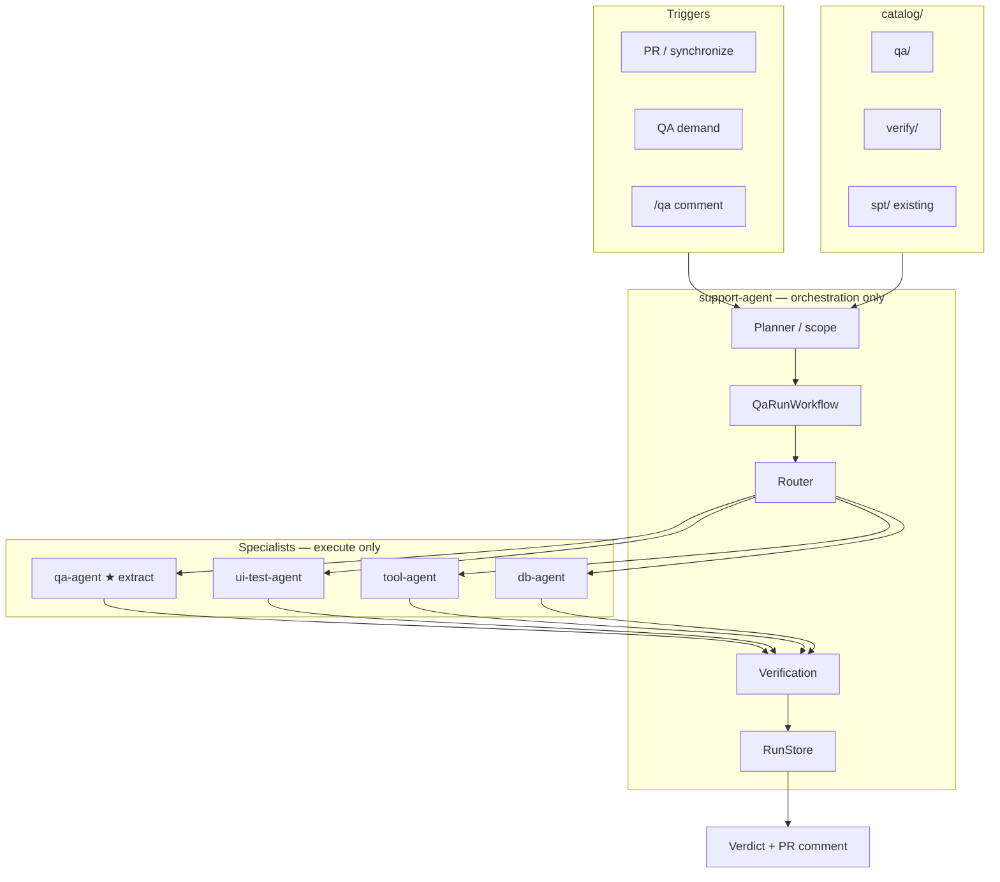

# QA Agent — Keep Plan

> **Status:** Draft — for review  
> **Owner:** AM-Portfolio Infrastructure Team  
> **Implementation repo:** `AM-Portfolio/am-agents`  
> **Last updated:** 2026-07-20

---

## 1. Purpose

Extract a dedicated **`qa-agent`** specialist and keep **all orchestration** in **support-agent**.

| Agent | Role |
|-------|------|
| **support-agent** | **Only orchestrator** — scope, route, fan-out, verify, RunStore, verdict |
| **qa-agent** | **New specialist** — execute QA cases (backend, system, network; frontend as decided) |
| **ui-test-agent** | Existing frontend E2E specialist (may remain preferred for UI) |
| **tool-agent** | Infra tools, observe/verify; existing SPT plugin until separate decision |
| **db-agent** | Optional data-layer checks |

> **Decision:** Extract **`am-agents/qa-agent/`**. Keep **all orchestration out** of that module.

> **Naming:** `fin-agent` is finance — out of scope for QA.

---

## 2. Problem

| Gap today | Impact |
|-----------|--------|
| No first-class QA executor module | Tests scattered across CI and specialists |
| support-agent would grow runners if QA logic is inlined | Orchestrator becomes bloated |
| PR Agent reviews code but does not run tests | Runtime bugs slip through |
| Need clear execute vs orchestrate split | Same pattern as ui-test-agent / db-agent |

---

## 3. Goals

| Goal | Success criteria |
|------|------------------|
| qa-agent as specialist | `am-agents/qa-agent/` with HTTP execute/status/cancel |
| Orchestration centralized | support-agent owns workflows, catalog, RunStore |
| Full-stack QA coverage | Backend, frontend, system, network via catalog + specialists |
| Catalog-driven | Selectors only; no service names in code (ADR-004) |
| Safe by default | Sandbox, allowlists, max targets, no prod writes |

### Non-goals

- Orchestration, Temporal, or parent RunStore **inside** qa-agent
- Replacing human release sign-off
- Auto-merge on QA pass
- Extracting a separate spt-agent in this plan (SPT stays on current path unless later folded)

---

## 4. Architecture



### Boundary lock

```text
support-agent     →  may call qa-agent over HTTP
qa-agent          →  must NOT import or call support-agent
qa-agent          →  must NOT expand selectors or fan-out siblings
qa-agent          →  must NOT write parent RunStore runs
qa-agent          →  must NOT own PR notify / HITL
```

### Request flow

1. **Trigger** — PR / QA demand / `/qa`
2. **Scope** — support-agent builds selector (rules; LLM optional later)
3. **Resolve** — `catalog/qa/` → TargetSet
4. **Policy** — sandbox, max targets, empty selector = fatal
5. **Fan-out** — support-agent calls **qa-agent** (and/or ui-test-agent / tool-agent) per target
6. **Verify** — optional tool-agent observe + `catalog/verify/`
7. **Report** — support-agent `overall_status` + PR comment

Detail: [agents/qa-agent.md](./agents/qa-agent.md).

---

## 5. Agent responsibilities

| Doc | Role |
|-----|------|
| [agents/qa-agent.md](./agents/qa-agent.md) | ★ Extract — execute only |
| [agents/support-agent.md](./agents/support-agent.md) | Orchestrator |
| [agents/tool-agent.md](./agents/tool-agent.md) | Observe / tools / SPT (existing) |
| [agents/ui-test-agent.md](./agents/ui-test-agent.md) | Frontend E2E |

### 5.1 support-agent (orchestration — stays)

- Owns `QaRunWorkflow`
- Catalog resolve, selector expand, failure_mode, budgets
- Routes via `registry/agents.yaml`
- Writes RunStore; final verdict
- Never embeds heavy test runners

### 5.2 qa-agent (new — execute only)

- HTTP: execute / status / cancel
- Runners: backend, system, network (+ frontend if chosen)
- Returns child result + evidence refs
- **No** Temporal workflows, **no** catalog planner, **no** PR notify

### 5.3 ui-test-agent / tool-agent

- Remain specialists; support-agent may still route to them
- SPT continues on existing support-agent `SptRunWorkflow` + tool-agent spt plugin unless later merged into qa-agent

---

## 6. Catalog

| Path | Purpose | Who reads |
|------|---------|-----------|
| `catalog/qa/` | QA targets by domain | **support-agent** (not qa-agent) |
| `catalog/verify/` | Health / metrics checks | support-agent → tool-agent observe |
| `catalog/spt/` | Perf/load (existing) | support-agent SPT path |

qa-agent receives **resolved params** only.

---

## 7. Testing domains

| Domain | Default specialist |
|--------|--------------------|
| Backend | **qa-agent** |
| System | **qa-agent** |
| Network | **qa-agent** |
| Frontend | ui-test-agent and/or qa-agent (open) |
| Verify | tool-agent observe |
| Performance (SPT) | existing SPT path (not this extract) |

---

## 8. Phased rollout

See [phases/PHASES.md](./phases/PHASES.md).

| Phase | Focus |
|-------|-------|
| **0** | This keep plan + review |
| **1** | Scaffold `am-agents/qa-agent/` + HTTP contract + registry entry |
| **2** | Wire support-agent `QaRunWorkflow` → qa-agent; pilot backend/network |
| **3** | System + frontend routing decision; PR `/qa` via am-pipelines |
| **4** | Intelligence (optional LLM scope) in **support-agent only** |

---

## 9. Safety

| Rule | Where |
|------|-------|
| Empty selector fatal | support-agent |
| Max targets per run | support-agent |
| Allowlists / sandbox | **qa-agent** (+ caller policy) |
| Secrets not in LLM / RunStore | ADR-002 / ADR-005 |
| No orchestration in qa-agent | Module boundary |

---

## 10. LLM (reminder)

| Stage | LLM? |
|-------|------|
| Catalog / route / execute / verdict | **No** |
| qa-agent runners | **No** (default) |
| Optional: PR diff → tags | support-agent later |
| Optional: PR comment narrative | support-agent / CI later |

---

## 11. Open decisions

| # | Question | Options |
|---|----------|---------|
| 1 | qa-agent default port | `8160` (proposed) |
| 2 | Frontend: qa-agent vs ui-test-agent | A) ui-test only · B) qa-agent · C) both by tag |
| 3 | Fold SPT into qa-agent later? | A) no — keep SPT path · B) yes later |
| 4 | Package layout | `app/` vs `src/am_qa_agent/` |
| 5 | PR blocking policy | advisory vs required per-repo |

---

## 12. Review checklist

- [ ] Approve extract **`qa-agent/`** as new module
- [ ] Approve **orchestration stays only in support-agent**
- [ ] Confirm catalog ownership stays outside qa-agent
- [ ] Decide frontend routing (open #2)
- [ ] Phase order approved

*Keep plan — update after review.*
