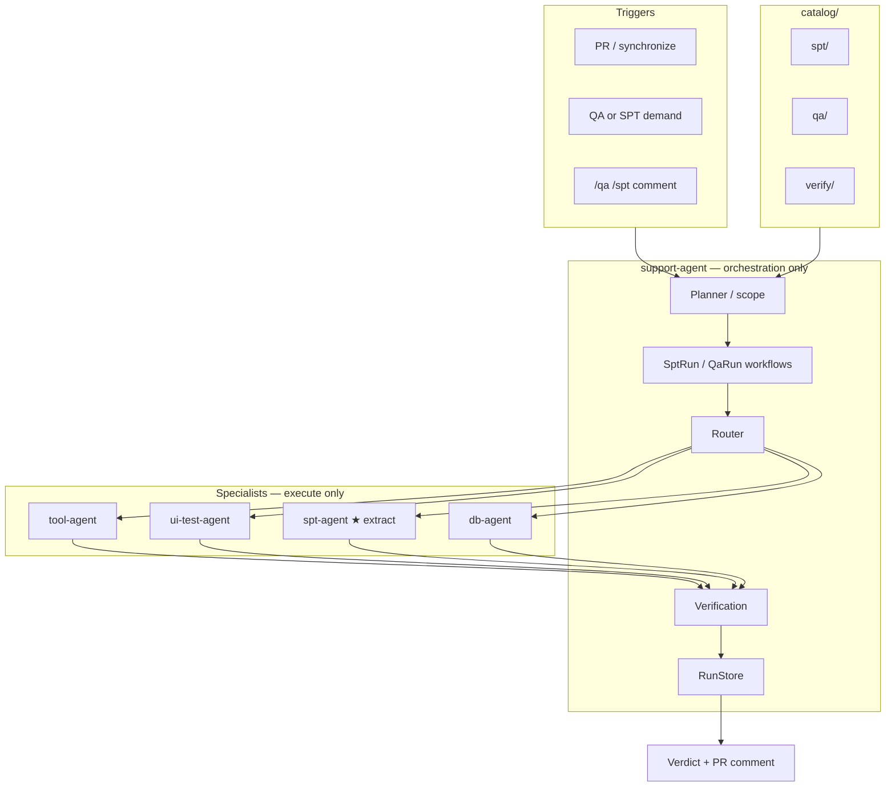

# QA Agent — Keep Plan

> **Status:** Draft — for review  
> **Owner:** AM-Portfolio Infrastructure Team  
> **Implementation repo:** `AM-Portfolio/am-agents`  
> **Last updated:** 2026-07-20

---

## 1. Purpose

Define how AM-Portfolio runs **all major testing** — backend, frontend, system, network, performance (SPT), and regression — on the existing agent platform, with one architectural lock:

| Agent | Role |
|-------|------|
| **support-agent** | **Only orchestrator** — scope, route, fan-out, verify, RunStore, verdict |
| **spt-agent** | **New specialist** — load/perf execute only (prepare / execute / status / cancel) |
| **tool-agent** | Backend, network probes, observe/verify checks |
| **ui-test-agent** | Frontend / UI E2E (Playwright) |
| **db-agent** | Optional data-layer checks |

> **Decision:** Extract SPT into a **new module `spt-agent/`**. Keep **all orchestration out** of that module.

> **Naming:** `fin-agent` (`am-fin-agent`) is finance — out of scope for QA/SPT.

---

## 2. Problem

| Gap today | Impact |
|-----------|--------|
| SPT logic embedded in `tool-agent/tools/spt/` | Load engines coupled to generic tool runtime |
| support-agent activities call tool-agent for SPT | Harder to scale k6 independently |
| PR Agent reviews code but does not run tests | Runtime bugs slip through |
| No single PR-triggered QA + SPT verdict | Fragmented signal |

---

## 3. Goals

| Goal | Success criteria |
|------|------------------|
| SPT as first-class specialist | `am-agents/spt-agent/` module with HTTP API |
| Orchestration stays centralized | support-agent owns workflows, catalog, RunStore |
| Full-stack QA coverage | Backend, frontend, system, network + SPT via specialists |
| Catalog-driven | Selectors only; no service names in code (ADR-004) |
| Safe by default | Sandbox, max targets, no prod writes |
| Clean cutover | Parity vs old tool-agent spt plugin, then deprecate plugin |

### Non-goals

- Orchestration, Temporal, or RunStore **inside** spt-agent
- Replacing human release sign-off
- Load test every PR
- Auto-merge on QA/SPT pass

---

## 4. Architecture



### Boundary lock

```text
support-agent     →  may call spt-agent over HTTP
spt-agent         →  must NOT import or call support-agent
spt-agent         →  must NOT expand selectors or fan-out siblings
spt-agent         →  must NOT write parent RunStore runs
```

### Request flow (SPT path)

1. **Trigger** — PR / SPT demand / `/spt`
2. **Scope** — support-agent builds selector (rules; LLM optional later)
3. **Resolve** — `catalog/spt/` (or `catalog/qa/perf/`) → TargetSet
4. **Policy** — sandbox, max targets, empty selector = fatal
5. **Fan-out** — support-agent calls **spt-agent** per target: prepare → execute → status
6. **Verify** — optional tool-agent observe + `catalog/verify/`
7. **Report** — support-agent `overall_status` + PR comment

Detailed SPT module: [agents/spt-agent.md](./agents/spt-agent.md).

---

## 5. Agent responsibilities

| Doc | Role |
|-----|------|
| [agents/support-agent.md](./agents/support-agent.md) | Orchestrator |
| [agents/spt-agent.md](./agents/spt-agent.md) | SPT extract — execute only |
| [agents/tool-agent.md](./agents/tool-agent.md) | Backend / network / observe |
| [agents/ui-test-agent.md](./agents/ui-test-agent.md) | Frontend E2E |

### 5.1 support-agent (orchestration — stays)

- Owns `SptRunWorkflow` / `QaRunWorkflow`
- Catalog resolve, selector expand, failure_mode, budgets
- Routes to specialists via `registry/agents.yaml`
- Writes RunStore; produces final verdict
- Never runs k6 itself

### 5.2 spt-agent (new — execute only)

- HTTP: prepare / execute / status / cancel
- Engines: memory (lab), k6 (sandbox)
- Returns `ChildRunResult`-shaped payloads
- **No** Temporal workflows, **no** catalog planner, **no** PR notify

### 5.3 tool-agent (after extract)

- Backend smoke, network probes, observe/verify
- **Loses** long-term ownership of `tools/spt/` (deprecated after cutover)

### 5.4 ui-test-agent

- Unchanged — Playwright E2E specialist

---

## 6. Catalog

| Path | Purpose | Status |
|------|---------|--------|
| `catalog/spt/` | Perf/load targets (services + flows) | **Exists** — consumed by support-agent |
| `catalog/verify/` | Health / metrics checks | **Exists** |
| `catalog/qa/` | Functional QA matrix | **Planned** |
| `catalog/prompts/` | Prompt bodies | **Exists** |

spt-agent does **not** own catalog files — it receives resolved params from support-agent.

See [catalog/README.md](./catalog/README.md).

---

## 7. Testing domains

| Domain | Specialist |
|--------|------------|
| Backend | tool-agent |
| Frontend | ui-test-agent |
| System | support-agent fan-out |
| Network | tool-agent |
| Performance (SPT) | **spt-agent** |
| Verify | tool-agent observe |

---

## 8. Data contracts

Reuse `am_platform_ports` where possible.

| Artifact | Owner |
|----------|-------|
| `SptDemandRequest` / selector | support-agent |
| Per-target execute request | support-agent → spt-agent |
| `ChildRunResult` | spt-agent (and other specialists) |
| `SptRunSummary` / `QaRunSummary` | support-agent |

See [contracts/README.md](./contracts/README.md).

---

## 9. Triggers

| Trigger | Orchestrator | Executor for load |
|---------|--------------|-------------------|
| SPT demand | support-agent `SptRunWorkflow` | spt-agent |
| PR + `/spt` or `/qa` | support-agent | specialists by domain |
| Release / scheduled | support-agent | spt-agent (+ others) |

---

## 10. Phased rollout

See [phases/PHASES.md](./phases/PHASES.md).

| Phase | Focus |
|-------|-------|
| **0** | This keep plan + review |
| **1** | Scaffold `spt-agent/` module + HTTP contract + registry entry |
| **2** | Wire support-agent activities to spt-agent; parity with tool-agent plugin |
| **3** | Deprecate `tool-agent/tools/spt/`; PR triggers; verify loop |
| **4** | Intelligence (optional LLM scope), dashboards |

---

## 11. Safety

| Rule | Where enforced |
|------|----------------|
| Empty selector fatal | support-agent |
| Max targets per run | support-agent |
| Sandbox required for k6 | **spt-agent** (+ caller policy) |
| Secrets not in LLM / RunStore | ADR-002 / ADR-005 |
| No orchestration in spt-agent | Module boundary + review |

---

## 12. LLM (reminder)

| Stage | LLM? |
|-------|------|
| Catalog / route / execute / verdict | **No** |
| spt-agent prepare/execute/status | **No** |
| Optional: PR diff → tags | support-agent later |
| Optional: PR comment narrative | support-agent / CI later |

---

## 13. Open decisions

| # | Question | Options |
|---|----------|---------|
| 1 | spt-agent default port | `8150` (proposed) vs other |
| 2 | Keep `catalog/spt/` vs move under `catalog/qa/perf/` | A) keep spt/ · B) migrate |
| 3 | Cutover: dual-run length | 1 release vs 2 |
| 4 | Package layout | `app/` (ui-test style) vs `src/am_spt_agent/` |
| 5 | PR blocking for SPT | advisory vs required per-repo |

---

## 14. Review checklist

- [ ] Approve **extract spt-agent** as new module
- [ ] Approve **orchestration stays only in support-agent**
- [ ] Approve deprecate path for `tool-agent/tools/spt/`
- [ ] Confirm catalog ownership stays outside spt-agent
- [ ] Phase order approved

*Keep plan — update after review.*
