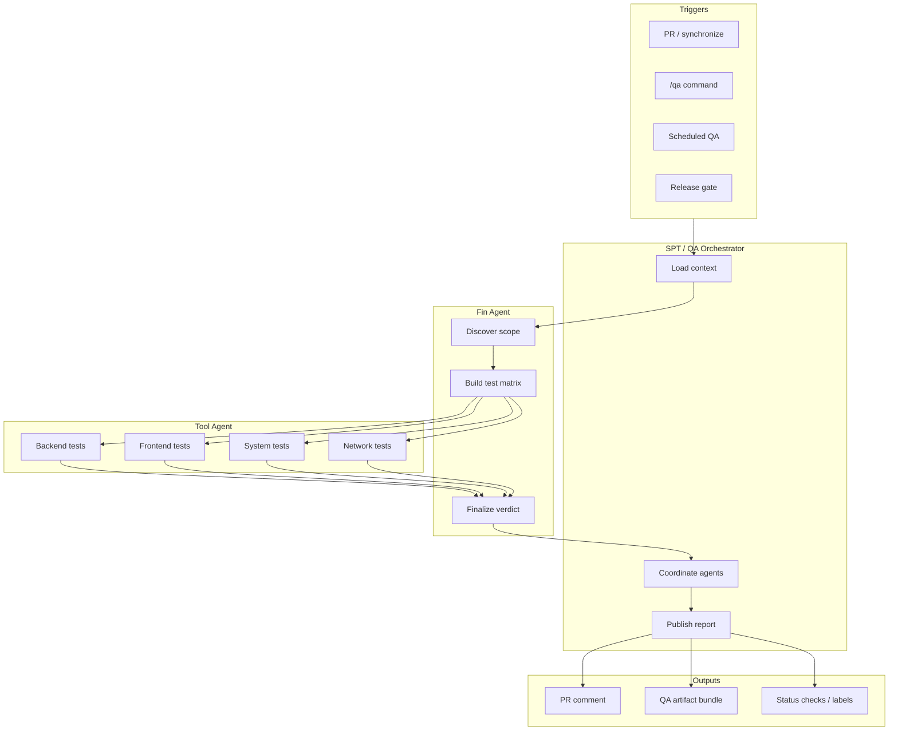

# SPT / QA Agent — Keep Plan

> **Status:** Draft plan (keep document)  
> **Owner:** AM-Portfolio Infrastructure Team  
> **Last updated:** 2026-07-20

This document is the living plan for building an **SPT / QA agent** that performs all major testing categories — backend, frontend, system, network, security, performance, and regression — by orchestrating two specialized sub-agents:

1. **Fin Agent** — *Find + Finalize*: discovers what to test and produces the final QA verdict.
2. **Tool Agent** — *Execute*: runs concrete tests using tools, scripts, and CI integrations.

---

## 1. Problem statement

Today, testing is fragmented:

- Backend tests live in one pipeline; E2E in another.
- Network and infra checks are manual or ad hoc.
- PR review (Gemini PR Agent) catches code issues but does not **execute** tests or validate runtime behavior across the full stack.

We need one **QA orchestrator** that can be triggered from PRs, releases, or on-demand, and that delegates work to agents with clear roles.

---

## 2. Goals

| Goal | Success criteria |
|------|------------------|
| **Full-stack coverage** | Backend API, frontend UI, system integration, network/connectivity |
| **Agent-driven execution** | Fin Agent scopes work; Tool Agent runs tools; orchestrator coordinates |
| **Actionable output** | Pass/fail, evidence (logs, screenshots, traces), linked to PR or release |
| **Safe by default** | Read-only discovery first; destructive tests only in approved environments |
| **Composable** | Works with existing `am-pipelines`, Cloud Agents, and org secrets |

### Non-goals (phase 1)

- Replacing human QA sign-off for production releases
- Running unbounded load tests on every PR
- Auto-merging based on QA agent results

---

## 3. Agent roles

### 3.1 SPT / QA Orchestrator (parent agent)

The top-level agent receives a trigger (PR opened, `/qa` command, scheduled run) and:

1. Loads repo context (changed files, env, deployment URL).
2. Invokes **Fin Agent** to build a test plan.
3. Dispatches **Tool Agent** jobs (parallel where safe).
4. Aggregates results into a single QA report.
5. Posts results to PR comment, issue, or dashboard.

### 3.2 Fin Agent — Find + Finalize

**Find (discovery phase)**

- Map changed code to test surfaces (API routes, UI pages, DB migrations, infra configs).
- Identify dependencies: services, ports, env vars, external APIs.
- Propose a **test matrix**: which domains apply, priority, and risk level.
- Flag gaps (e.g. "no frontend tests for changed component").

**Finalize (reporting phase)**

- Merge Tool Agent outputs into one structured verdict.
- Classify: blocking vs non-blocking findings.
- Recommend next actions (fix, retest, escalate).
- Attach evidence links and reproduction steps.

**Tools Fin Agent uses (read-heavy)**

- Code search / AST / diff analysis
- OpenAPI / GraphQL schema discovery
- Route and component inventory
- Dependency and env manifest parsing
- Prior run history (flaky test detection)

### 3.3 Tool Agent — Execute

Runs actual tests and collects artifacts.

**Backend**

- Unit / integration: `pytest`, `jest`, `go test`, etc.
- API contract: schema validation, status codes, auth flows
- DB: migration dry-run, seed sanity checks

**Frontend**

- Component / unit tests
- E2E: Playwright / Cypress against preview or staging URL
- Visual regression (optional phase 2)
- Accessibility smoke (axe)

**System**

- Multi-service flows (login → checkout → webhook)
- Health checks across services
- Config and feature-flag consistency
- Container / k8s readiness (where applicable)

**Network**

- DNS resolution, TLS cert validity
- Port reachability, latency thresholds
- Firewall / egress policy checks (align with Cloud Agent egress rules)
- Webhook delivery and retry behavior
- CDN / load balancer header checks

**Tool Agent toolbelt (examples)**

| Category | Tools |
|----------|-------|
| HTTP/API | `curl`, `httpx`, Postman/Newman, REST Client |
| Browser | Playwright, Puppeteer |
| Load | k6, Locust (staging only) |
| Network | `dig`, `openssl s_client`, `nc`, `traceroute` |
| Security smoke | OWASP ZAP baseline, dependency audit |
| Infra | `kubectl`, health endpoints, smoke scripts |

---

## 4. Architecture



### Execution model

| Step | Agent | Output |
|------|-------|--------|
| 1 | Orchestrator | Run ID, repo ref, target environment |
| 2 | Fin Agent | `test-plan.json` — domains, cases, priorities |
| 3 | Tool Agent (×N) | Per-domain `results.json` + artifacts |
| 4 | Fin Agent | `qa-verdict.json` — pass/fail, findings |
| 5 | Orchestrator | Human-readable report + CI status |

---

## 5. Testing domains (coverage map)

| Domain | What we validate | Typical Tool Agent actions |
|--------|------------------|----------------------------|
| **Backend** | APIs, auth, business logic, DB | Run test suites; hit endpoints; validate schemas |
| **Frontend** | UI flows, routing, forms, a11y | Playwright scenarios; unit test run |
| **System** | End-to-end cross-service behavior | Synthetic user journeys; health aggregation |
| **Network** | Connectivity, TLS, DNS, latency | Probe endpoints; cert checks; traceroute |
| **Security** (phase 2) | OWASP basics, secrets in diff | ZAP baseline; secret scan |
| **Performance** (phase 2) | SLOs under load | k6 on staging |

Detailed breakdown: [testing-domains/overview.md](./testing-domains/overview.md).

---

## 6. Triggers and integration

### 6.1 PR workflow (recommended first)

Extend the org pattern used by the Gemini PR Agent:

```yaml
# Future: .github/workflows/spt-qa-agent.yml
on:
  pull_request:
    types: [opened, synchronize, ready_for_review]
  issue_comment:
    types: [created]  # /qa, /qa backend, /qa full
```

- Reuse secrets: `GOOGLE_API_KEY`, `GH_TOKEN`
- Call reusable workflow in `am-pipelines` (mirror `reusable-pr-agent.yml`)
- Post QA summary as PR comment; apply labels: `qa:pass`, `qa:fail`, `qa:partial`

### 6.2 Cloud Agent run

For deep system/network runs:

- Spin Cloud Agent with egress policy matching target environment
- Fin Agent explores repo; Tool Agent runs in isolated tmux sessions
- Artifacts uploaded to run bundle (screenshots, HAR, logs)

### 6.3 Manual commands

| Command | Behavior |
|---------|----------|
| `/qa` | Full matrix from Fin Agent on changed files |
| `/qa backend` | Backend + API only |
| `/qa frontend` | Frontend + E2E only |
| `/qa network` | Network probes against declared URLs |
| `/qa retest` | Re-run last failed cases only |

---

## 7. Data contracts

### 7.1 Test plan (Fin Agent → Tool Agent)

```json
{
  "run_id": "qa-20260720-abc123",
  "repo": "org/service-api",
  "ref": "feature/checkout-v2",
  "environment": "preview",
  "domains": [
    {
      "name": "backend",
      "priority": "P0",
      "cases": [
        { "id": "api-health", "command": "curl -f https://preview/health" },
        { "id": "pytest-unit", "command": "pytest tests/unit -q" }
      ]
    },
    {
      "name": "frontend",
      "priority": "P1",
      "cases": [
        { "id": "e2e-checkout", "tool": "playwright", "spec": "e2e/checkout.spec.ts" }
      ]
    }
  ]
}
```

### 7.2 Result bundle (Tool Agent → Fin Agent)

```json
{
  "case_id": "api-health",
  "status": "passed",
  "duration_ms": 120,
  "evidence": ["logs/health-response.json"],
  "metrics": { "latency_ms": 45 }
}
```

### 7.3 QA verdict (Fin Agent → Orchestrator)

```json
{
  "verdict": "fail",
  "blocking_count": 1,
  "summary": "Checkout E2E failed: payment webhook timeout",
  "domains": {
    "backend": "pass",
    "frontend": "fail",
    "system": "fail",
    "network": "pass"
  },
  "findings": [
    {
      "severity": "blocking",
      "domain": "system",
      "title": "Webhook timeout",
      "reproduction": "Run e2e/checkout.spec.ts against preview"
    }
  ]
}
```

---

## 8. Phased rollout

### Phase 0 — Plan and scaffolding (current)

- [x] Keep plan document (this file)
- [ ] Agent prompt specs for Fin and Tool agents
- [ ] JSON schemas for plan / results / verdict
- [ ] Decision on model(s) and `am-pipelines` reusable workflow

### Phase 1 — Backend + smoke (4–6 weeks engineering)

- Fin Agent: diff → API test list
- Tool Agent: run existing unit/integration suites in CI
- PR comment with pass/fail summary
- Labels on PR

### Phase 2 — Frontend E2E

- Preview URL discovery from PR deployments
- Playwright via Tool Agent
- Screenshot artifacts on failure

### Phase 3 — System + network

- Multi-service health matrix
- TLS/DNS/latency probes from Cloud Agent
- Synthetic journey scripts per product

### Phase 4 — Intelligence

- Flaky test tracking
- Risk-based test selection (only high-impact paths on small diffs)
- Trend dashboard across repos

---

## 9. Safety and governance

| Rule | Rationale |
|------|-----------|
| **No prod writes from QA agent** | Tool Agent uses read-only or staging credentials |
| **Network scans scoped** | Only declared hosts; respect egress allowlists |
| **Secrets never in logs** | Redact tokens in evidence bundles |
| **Human override** | `qa:waived` label requires approver role |
| **Rate limits** | Cap parallel Tool Agent jobs per org |

---

## 10. Operating model

### When to run what

| Event | Fin Agent scope | Tool Agent depth |
|-------|-----------------|------------------|
| Small doc PR | Minimal / skip | Lint only |
| API change | Backend P0 | Full API + unit |
| UI change | Frontend P0 | Unit + targeted E2E |
| Infra / DNS change | Network P0 | Probes + system smoke |
| Release candidate | Full matrix | Full regression + staging load |

### Escalation

1. **Blocking fail** → PR cannot merge (if branch protection enabled)
2. **Flaky fail** → Fin Agent marks `investigate`; does not block until confirmed
3. **Environment down** → Verdict `inconclusive`; retry policy applies

---

## 11. Success metrics

- **Coverage:** % of PRs with automated QA run
- **Signal:** % of post-merge incidents that QA agent would have caught
- **Latency:** median QA run time per PR
- **Noise:** false positive rate (target < 5%)
- **Adoption:** repos opted in vs org total

---

## 12. Open decisions

| # | Question | Options |
|---|----------|---------|
| 1 | Primary model for orchestrator | Gemini 1.5 Flash (align with PR agent) vs mixed |
| 2 | Fin Agent naming | Keep "Fin" (Find+Finalize) vs rename to "Scope Agent" |
| 3 | Blocking policy | Org-wide required vs per-repo opt-in |
| 4 | Preview URL source | Vercel/Netlify comments vs custom deployment API |
| 5 | am-pipelines location | New `reusable-spt-qa-agent.yml` vs extend PR agent |

---

## 13. Related docs

- [agents/tool-agent.md](./agents/tool-agent.md)
- [agents/fin-agent.md](./agents/fin-agent.md)
- [testing-domains/overview.md](./testing-domains/overview.md)
- Org PR Agent: [README.md](../README.md)

---

## 14. Next actions

1. Review and approve this keep plan with infra + QA leads.
2. Add JSON schemas under `spt-qa-agent/schemas/`.
3. Prototype Fin Agent prompt against one pilot repo.
4. Implement Phase 1 reusable workflow in `am-pipelines`.
5. Document `/qa` commands in org contributing guide.

*This is a keep plan — update it as phases complete and decisions close.*
